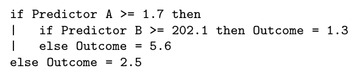
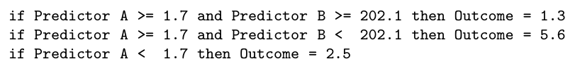
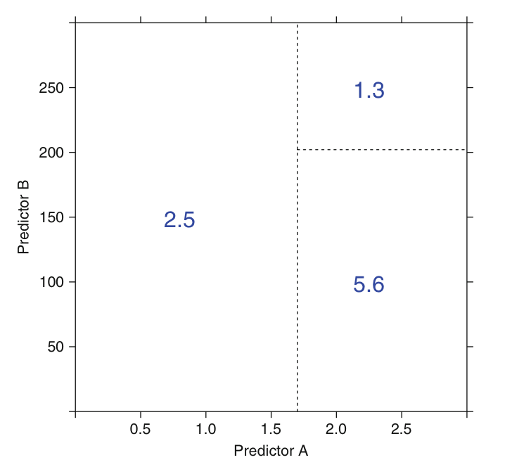
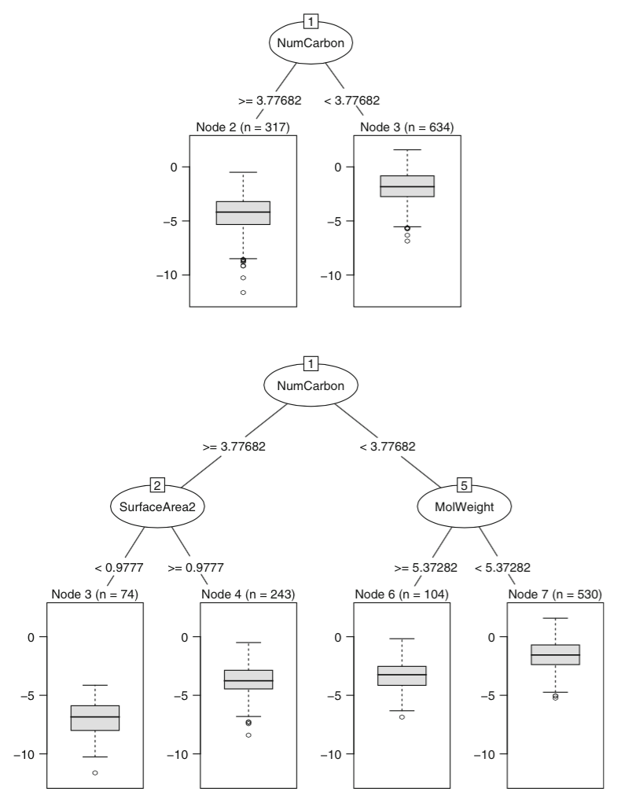
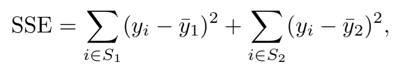
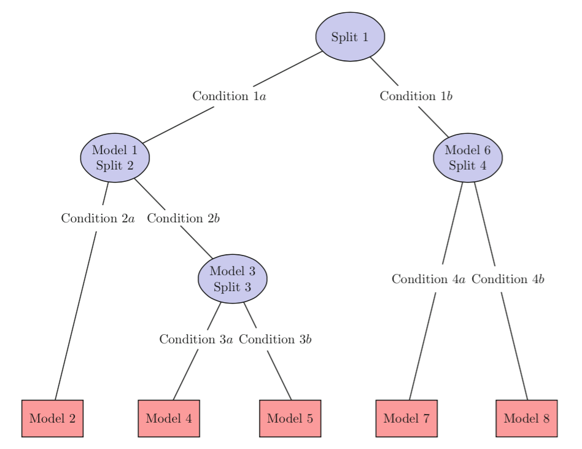

# Predição Numérica

Créditos: Aula baseada no livro 'Applied Predictive Modeling'

## Setup

```{r }
library('caret')
library('ggplot2')
library('reshape')
library('RWeka')
```

Usaremos dados de vinhos: (http://www3.dsi.uminho.pt/pcortez/wine/)

```{r }
wines <- read.csv("winequality/winequality-red.csv", sep=";")
summary(wines)
```


Particionando os dados

```{r }
set.seed(825)
# preserva o balanceamento entre as classes
inTrain <- createDataPartition(y = wines$quality,
                               p = .7,
                               list = FALSE)
training <- wines[ inTrain,]
testing <- wines[-inTrain,]

fitControl <- trainControl(## 10-fold CV
                           method = "repeatedcv",
                           number = 10,
                           ## repeated ten times
                           repeats = 1)
```

Até aqui, vimos predição categórica, comumente utilizada em problemas de classificação. No entanto, podemos utilizar *Trees para predição numérica.

Antes, vamos falar sobre as métricas para avaliar os modelos:

- RMSE (root mean squared error)
- RSquared (coeficiente de determinação): Quanto o modelo explica?

## Regression Trees

'As opposed to regression equations, regression trees are decision trees whose leaves represent numeric outcome for their respective region of the data.
This results in more accurate prediction than regression equation method though they tend to be more complex in nature.'

Model trees combinam os dois: a folha é uma equação, ao invés de um número. Ou seja, Model Trees apresentam diferentes equações para diferentes regiões dos dados.







Para cada preditor, escolher o valor que divide 2 grupos tal que a soma do erro quadrático é minimizada.
Quando esse processo acaba, a árvore pode ser muito grande e é provável que apresente overfitting. 

**Complexity parameter**: A árvore, então, é 'cortada' em um processo para encontrar a menor árvore com a menor penalização (tamanho da árvore é utilizado como penalização).





- Fácil de interpretar
- Fácil de implementar
- Não paramétrico
- Pequenas mudanças nos dados pode afetar muito o modelo
- Complexidade e custo computacional

## Model Trees

Regression Trees não são boas para valores muito altos ou muito baixos, pois as folhas contém a média do conjunto de treino para predição.

Model Trees: ao invés da média, as folhas possuem um modelo.



## Exemplos no caret

'The prediction variance for the ensemble of trees will be less than the variance of predictions from individual trees.'

Bagged Trees utiliza todos os preditores aplicando bootstraping nos dados, enquanto RF os seleciona aleatoriamente (random top k predictors). 

mtry é o 'tunning parameter': número de preditores escolhidos. Recomenda-se 1/3 dos preditores.

[Muitos modelos aqui.](http://topepo.github.io/caret/Tree_Based_Model.html)

Single Tree
```{r warning=FALSE}
stree = m5 <- train(quality ~ ., data = training,
              method = 'ctree',
              trControl = fitControl)

stree
# mincriterion defines the statistical criterion that must be met in order to continue splitting; maxdepth is the maximum depth of the tree. 
plot(stree)
plot(varImp(stree))
```

Model Tree
```{r warning=FALSE}
m5 <- train(quality ~ ., data = training,
  method = 'M5',
  trControl = fitControl)

m5
plot(m5)
plot(varImp(m5))
```


Bagged Tree
```{r warning=FALSE}
treebag <- train(quality ~ ., data = training,
  method = 'treebag',
  trControl = fitControl)
# Não há tunning parameters
treebag
plot(varImp(treebag))
```

Random Forest
```{r warning=FALSE}
# ctry e ntrees: tunning parameters
rf <- train(quality ~ ., data = training,
  method = "cforest",
  trControl = fitControl)
rf
plot(rf)
plot(varImp(rf))
```


Comparando técnicas baseadas em árvores...
```{r warning=FALSE}
results <- resamples(list(simple = stree, mfive = m5, randomf = rf, treebag = treebag))
bwplot(results)
```

SVM (minimiza o efeito de outliers)

'One drawback of minimizing SSE is that the parameter estimates can be influenced by just one observation that falls far from the overall trend in the data. When data may contain influential observations, an alternative minimization metric that is less sensitive, such as the Huber function, can be used to find the best parameter estimates. This function uses the squared residuals when they are “small” and uses the absolute residuals when the residuals are large.'

Threshold set by the user (denoted as e).

'If the values are unknown, they can be estimated through resampling. In train, the method values of "svmRadial", "svmLinear", or "svmPoly" fit different kernels.'
```{r warning=FALSE}
svmRTuned <- train(quality ~ ., data = training,
                    method = "svmRadial",
                    preProc = c("center", "scale"),
                    tuneLength = 14)

svmRTuned
#946 training set data points as support vectors
plot(svmRTuned)
plot(varImp(svmRTuned))
```