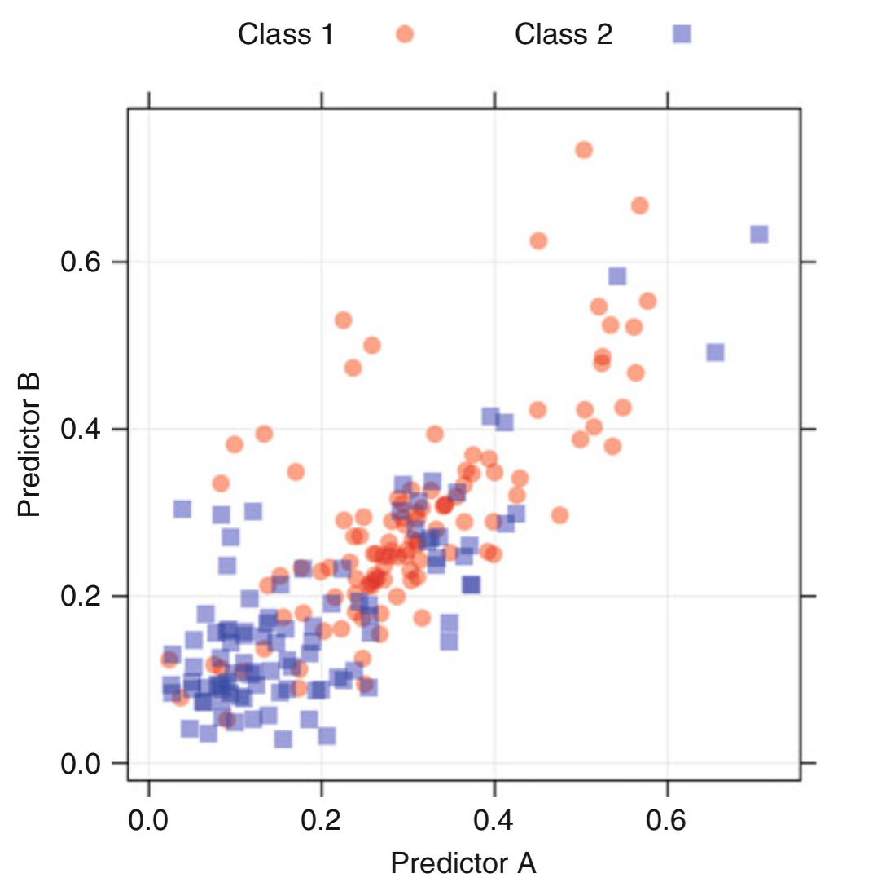
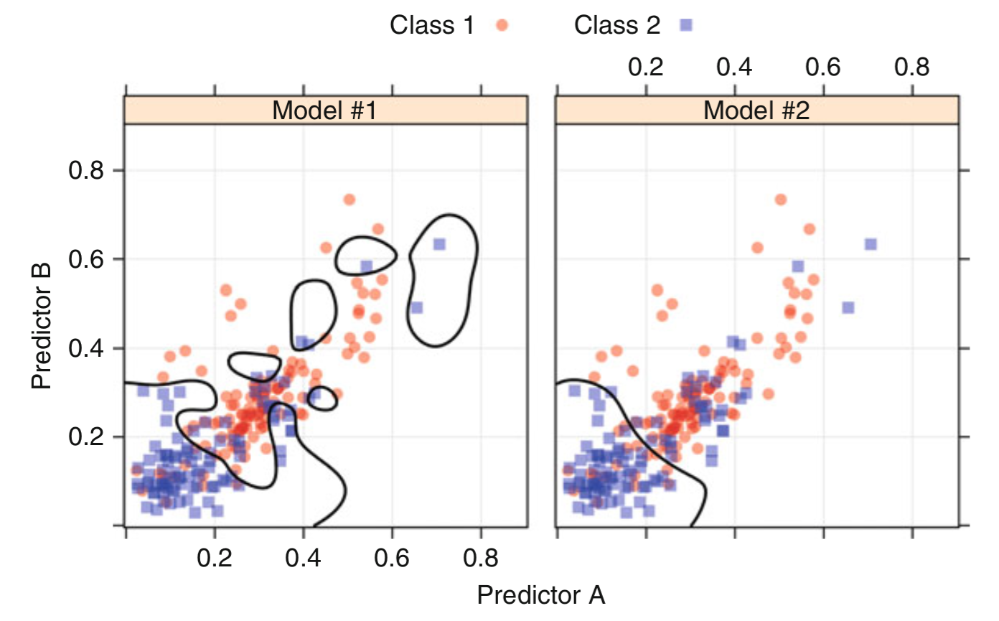
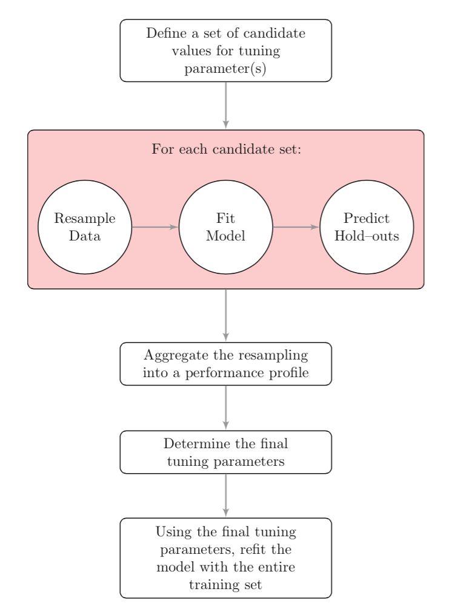

# Objetivos

- Apresentar o problema de overfitting
- Introduzir estratégias para lidar com overfitting
  

# O Problema: Overfitting

Existem técnicas que são capazes de prever com 100% de acurácia em uma determinada amostra, mas não
possuem o mesmo desempenho em outras amostras. Em uma análise detalhada sobre os dados, alguns modelos, além de aprenderem
a estrutura dos dados, também são capazes de capturar seus ruídos, o que os tornam excelentes modelos para essas amostras
específicas, mas pouco generalizáveis.





# As soluções

Para lidar com overfitting, é preciso detecta-lo. Para isso, utilizamos uma técnica para caracterizar quão dependente da amastra está a acurácia de um modelo, isto é,
o seu nível de overfitting para os dados de treino. A essa técnica, damos o nome de model tunning.

## Model Tunning

Quantos vizinhos utilizar para definir a classe de um novo ponto? Esse é um parâmetro que não conseguimos estimar a partir da amostra. Não há fórmula para decidir o valor desse parâmetro. Por isso, dá-se o nome de tunning parameter a esses parâmetros. 

Tunning parameters são comuns.

Como encontrar o os melhores parâmetros? A ideia principal é variar os valores dos parâmetros e testa-los
com diferentes amostras (resampling) para encontrar o valor ótimo. Veja o workflow abaixo:



No examplo anterior, utilizando o KNN, o conjunto de valores candidatos para k poderia ser os valores
ímpares de 1 a 9 (para evitar empates). Os dados de treino seriam continuamente re-organizados 
e avaliados várias vezes para cada valor de k. Os resultados para cada rodada seriam então agregados 
para encontrar o valor ótimo de k.

- Tips
  - testar o modelo em amostras que não foram utilizadas para treino
  - *resampling* dos dados treino 

## Data Splitting

Workflow para construção de modelos:

- Pre-processing the predictor data
- Estimating model parameters
- Selecting predictors for the model
- Evaluating model performance
- Fine tuning class prediction rules (via ROC curves, etc.)


- Tips
-- Nos casos em que queremos obter dados de treino e teste homogêneos, utilizamos particionamento aleatório dos dados.
-- Nem sempre o particionamento deve ser aleatório. Algumas vezes, queremos checar quão generalizável pode ser um modelo.
-- Se a distribuição entre classes é desproporcional, utilizamos 
'stratified random sampling'. Se for númerico, podemos criar categorias (baixo, médio, alto) e aplicar a amostragem nas categorias.
-- Alternativa: medidas de dissimilaridade entre amostras


## Resampling techniques

k-fold cross-validation
Bootstraping


# Predição numérica 

Material de Leandro para motivação: até aqui, vimos classificação.

No entanto, podemos utilizar SVM e RF para regressão (a.k.a SVR).

As métricas para avaliar o modelo mudam: 

- RMSE: calcula os residuos (Erro) -> eleva ao quadrado (erro quadrático) -> média (MSE erro quadrático médio) -> raiz quadrada (RMSE raiz quadrada do erro quadrático médio)

- RSquared (coeficiente de determinação): Quanto o modelo explica?


# SVR: Support Vector Regression (SVR)
[Vários modelos com implementação no caret](http://topepo.github.io/caret/Support_Vector_Machines.html)

# RF

randomForest will default to classification or regression depending on the class of the variable. 

```{r }
library('MASS')
library('caret')
library('ggplot2')
library('reshape')
# Decrição dos dados: https://stat.ethz.ch/R-manual/R-devel/library/MASS/html/Boston.html
data(Boston)

# Particionando os dados
set.seed(825)
# preserva o balanceamento entre as classes
inTrain <- createDataPartition(y = Boston$medv,
                               p = .75,
                               list = FALSE)
training <- Boston[ inTrain,]
testing <- Boston[-inTrain,]

# Falar das duas técnicas: k-fold e bootstrapping
fitControl <- trainControl(## 10-fold CV
                           method = "repeatedcv",
                           number = 10,
                           ## repeated ten times
                           repeats = 3)


# Várias estratégias usando SVM: http://topepo.github.io/caret/Support_Vector_Machines.html
set.seed(825)
svm_radial <- train(data = training , medv ~ .,
  method = 'svmRadial',
  trControl = fitControl)

# Discutir saida do svm_radial
svm_radial


#TrainData <- Boston[,1:13]
#TrainClasses <- Boston[,14]
#set.seed(825)
#svm_radial <- train(TrainData, TrainClasses,
#  method = 'svmRadial',
#  trControl = fitControl)
#svm_radial


set.seed(825)
rf <- train(medv ~ ., data = training,
  method = 'qrf',
  trControl = fitControl)

# Discutir saída do rf
rf
results <- resamples(list(svm = svm_radial, qrf = rf))
bwplot(results)


# Plotar os dois. SVM 'chuta mais valores altos'.
# newdata = training
pred = predict(rf)
#pred = predict(svm_radial, newdata = Boston)

to_plot = data.frame(pred,Boston$medv)
ggplot(to_plot, aes(pred, Boston$medv)) + geom_point() + stat_abline()
```

TODO

- explicar dataset
- entender por cima svm e rf. qual usar no caret. 
- explicar gráficos
- entender saída do caret